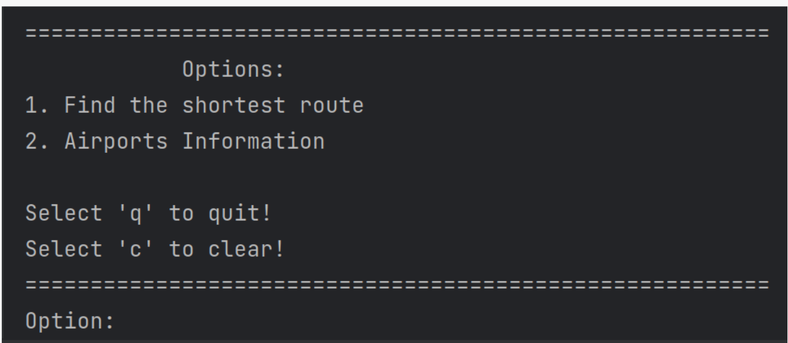

## Flight Routes

Trabalho proposto pela Faculdade de Engenharia da Universidade do Porto, no âmbito da disciplina de Algoritmos e Estruturas de Dados.
Consistiu na elaboração de um programa capaz providenciar ajuda para quem quer usar a rede de voos das companhias aéreas de todo o mundo. Os dados estão disponíveis sob a forma de ficheiros csv (comma separated values) e foram obtidos diretamente a partir do site OpenFlights.
O sistema desenvolvido tem um pequeno menu, expondo as funcionalidades implementadas.

